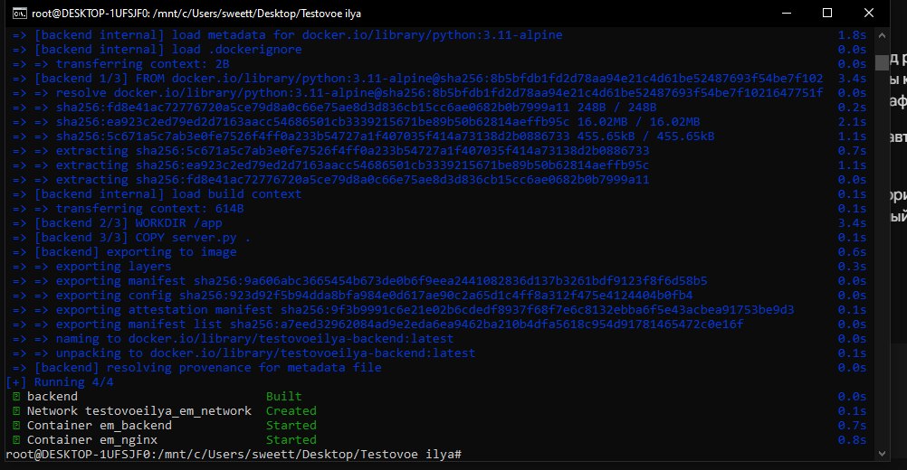
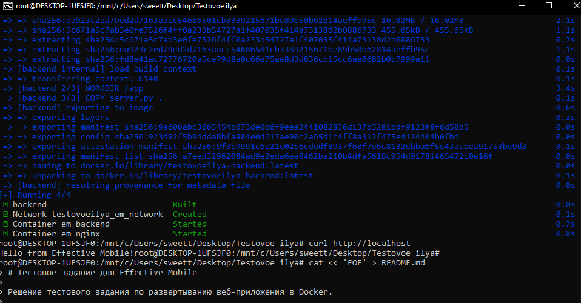

Приветствую! С удовольствием выполнил тестовое задание. 

Инфраструктура полностью развернута, настроена и готова к проверке.

Что было сделано:
1. Заполнены конфигурационные файлы docker-compose.yml и .env, переменные окружения и порты пробрасываются динамически.
2. Поднят веб-сервер на базе Python 3.11 Alpine в связке с обратным прокси-сервером Nginx (Alpine).
3. Настроена изолированная внутренняя сеть Docker, доступ к бэкенду осуществляется строго через проксирование на 80-м порту.
4. Локальный запуск и тесты цепочки "Клиент -> Nginx -> Python" прошли успешно.

Результаты работы:
• Ссылка на GitHub-репозиторий с проектом и инструкцией по запуску (README): 
https://github.com/Sweettmq/effective-mobile-docker-tz

Во вложении прикрепляю скриншоты:
1. Успешный билд и старт всех контейнеров в изолированной сети.
2. Проверочный запрос через curl к localhost на 80-м порту с ожидаемым ответом «Hello from Effective Mobile!».

Буду рад получить технический фидбек от команды! 
## Результаты тестирования

### Старт контейнеров в изолированной сети:

### Проверка работы приложения через curl:

